# Çınarlı Park audit — 22 September 2026

Remediation sequence, dependencies, and acceptance checks: [FIX_PLAN.md](FIX_PLAN.md).

**Original audit verdict, before fixes: not ready for production sign-off.** This review recorded **25 findings: 13 High, 10 Medium, and 2 Low**. The original observations below are preserved; the implementation update distinguishes local repairs from outstanding production work.

## Implementation update — 22 September 2026

Repository fixes have been implemented and checked locally. **Production sign-off remains pending:** no production deployment or hosting changes were made, and the host's process count is still unconfirmed.

| Findings | Current implementation and evidence |
| --- | --- |
| H03 | Request-time auth check via `connection()`. Production build followed by runtime-only credentials passes; actual browser login also passes. |
| H05, H06, H07 | Serialized site/mode writes with revisions, corruption-safe lead reads, and content validation. Concurrent-write and corruption tests pass. Two browser tabs demonstrate an explicit stale-save conflict with the draft preserved. Coordination requires one serving Node process. |
| H08 | 16 KiB streamed-body cap, bounded in-memory rate limiter, and a serialized 60-second duplicate check. HTTP tests pass for oversized/malformed requests, throttling and duplicate submission. Proxy identity and single-process deployment still need host confirmation. |
| H09, M06 | CSV formula protection and non-truncating phone validation pass regression tests; browser input rejects excess digits. CSV opening in the business's spreadsheet application remains a release smoke check. |
| H10, H11 | Calculator recalculates with input validation. Enquiry actions reach existing callback forms, with apartment/source/locale retained. Calculator and apartment callbacks pass browser checks; appointment focus passes in AZ/RU/EN. |
| H12 | The sample placeholder number is never shown publicly; call/WhatsApp buttons and the office phone row stay hidden until a real number is saved in the admin panel. Forms remain available. The real number still has to be entered by the business. |
| H13 | Canonical fallback and admin preview now use the shared configured origin. Browser checks confirm `chinarlipark.az` canonicals in all locales. Confirm the preferred live hostname and rebuild/deploy with `NEXT_PUBLIC_SITE_URL`. |
| M01, M02, M05 | Empty FAQ lists retain their object template; partial imports preserve current edits; title edits preserve existing news IDs. All three pass admin browser checks, including save/reload and the original published news URL. |
| M03, M04 | Homepage uses the saved gallery order; apartment photos render in the existing viewer. An authenticated upload and subsequent publication were verified with isolated fixture data. |
| M07, M08, M09, M10 | Language links retain query/hash; gallery/mobile dialogs manage focus; quick-search focus is visible; floor plans open with a button and keyboard controls. Browser checks pass, including mobile menu focus restoration. |
| L01, L02 | Reduced-motion scrolling uses `auto`; JSON-LD uses the saved project total. Verified computed style and an edited total of 511 in structured data. |
| H04 | The cPanel Node.js app runs from `repositories/Cinarli` with `DATA_DIR` already outside it; `.cpanel.yml` now builds in place with locked dependencies and restarts Passenger. It no longer copies source or the ignored `storage` folder. README documents the push-to-deploy flow and the manual buttons. A first real deployment on the host is still pending. |
| H01, H02 | Still require the host to repair certificates and enforce HTTPS. No live transport changes were attempted. |

Verification: `npm run build` passes (45 prerendered pages; admin/login are dynamic), `npm test` passes **9 tests**, and `npm run lint` passes with the two existing Open Graph image warnings. The release script passes `bash -n`. GitHub Actions runs the same build/test baseline. Node reports an informational module-type warning when directly importing the repository's ES-module helpers; the CommonJS custom server remains compatible.

Local browser evidence: [public flows](audit-evidence/2026-09-22-fixes/browser-results.json), [admin edits](audit-evidence/2026-09-22-fixes/admin-results.json), [media and save conflict](audit-evidence/2026-09-22-fixes/media-conflict-results.json), [locale checks](audit-evidence/2026-09-22-fixes/locale-results.json). Inspected screenshots: [calculator](audit-evidence/2026-09-22-fixes/calculator.png), [mobile menu](audit-evidence/2026-09-22-fixes/mobile-menu.png), [floor plan](audit-evidence/2026-09-22-fixes/floor-plan.png), [FAQ](audit-evidence/2026-09-22-fixes/faq.png), [save conflict](audit-evidence/2026-09-22-fixes/save-conflict.png), [apartment photo](audit-evidence/2026-09-22-fixes/apartment-photo.png). These use temporary storage and synthetic fixtures, not live leads or inventory.

The optional [UI skill static scan](audit-evidence/2026-09-22-fixes/ui-skill-scan.json) reports 12 existing convention/ownership flags involving native fields, form validation declarations, and resizable textareas. It is not a clean skill-compliance result; those broader conventions remain outside the agreed audit-fix scope. Public sample-content fallback is unchanged. Full screen-reader/performance work remains optional as agreed.

## Branch, scope, and evidence

- Ran `git fetch origin main`, then `git merge --ff-only origin/main`. Already current: `main` and `origin/main` both point to `85c6427520022afc6b8ba122026765bd00b424f6` (`Serverjs added`), with zero commits ahead or behind.
- Preserved the original untracked report byte-for-byte at [2026-09-21-AUDIT.md](audit-evidence/2026-09-21-AUDIT.md), with matching SHA-256 hashes. This review supersedes its current-state observations.
- Reviewed routing, auth, server actions, leads/export, persistence, uploads, admin editors, localization, SEO, deployment, and public UI. Consulted the installed Next.js 16.3.5 guides on request-time rendering, server actions, and self-hosting.
- Built and ran the production application through the checked-in `server.js`. Used a separate development server with generated local credentials for admin UI checks. All writes used temporary `DATA_DIR` directories outside the repository.
- Captured and inspected isolated Chrome screenshots at 1440 × 1000 and 390 × 844. The in-app browser execution tool was unavailable; the fallback used a separate headless Chrome profile and its DevTools protocol.
- Rechecked public HTTP/TLS on `chinarlipark.az` and `www.chinarlipark.az`, identified by the earlier report. No live login attempts, submissions, uploads, or content changes were made.
- Application source/configuration were not changed during the original audit. Subsequent implementation and its verification are recorded above.

**Evidence labels:** Live = current public response; Browser = local UI/DOM interaction; Reproduced = isolated execution of application functions/endpoints; Source = inspected code path without claiming an end-to-end reproduction.

## High-priority findings

### H01 — Both live hostnames serve an expired TLS certificate

**Live.** Both certificates report `valid_to: Dec 15 23:59:59 2025 GMT`; TLS reports `CERT_HAS_EXPIRED`. Certificate inspection disabled rejection only to inspect the certificate, not to establish a trusted connection. See [HTTP/TLS evidence](audit-evidence/2026-09-22/http-results.json).

**Impact:** Visitors encounter a certificate error before reaching the site or admin.

**Repair:** Install a valid certificate and full chain for both names, verify with normal certificate validation, and check renewal automation. This is a hosting change.

### H02 — Plain HTTP serves the administrator password form

**Live and Source.** Both `http://chinarlipark.az/admin/login` and its `www` equivalent return 200 with a password input and no redirect. The form submits on its current origin. Production session cookies use `secure: true` in [auth.js:33](src/lib/auth.js#L33).

**Impact:** Credentials and lead information can be submitted without encryption; secure cookies also prevent normal production sessions on HTTP.

**Repair:** After H01, redirect HTTP to the chosen HTTPS origin at the reverse proxy, including login and form paths. Add HSTS after verifying HTTPS works.

### H03 — Building without credentials freezes the unavailable login state

**Reproduced and Browser.** The build classified `/admin` and `/admin/login` as static. Starting it with all three `ADMIN_*` variables configured still returned `x-nextjs-cache: HIT`, the configuration warning, and no password input. The cached `/admin` redirect persists too.

**Cause:** [auth.js:46](src/lib/auth.js#L46) returns before `cookies()` when configuration is absent, so prerendering never encounters a request-time API.

**Repair:** Establish request-dependent rendering before checking configuration, using the installed version's `connection()` API or appropriate request-time cookie access. Test building without secrets and starting with them. [Next.js connection reference](https://nextjs.org/docs/app/api-reference/functions/connection).

**Screenshot:** [07 — cached login](audit-evidence/2026-09-22/07-production-login-unavailable.png).

### H04 — cPanel tasks do not define a complete, safe deployment

**Source.** [.cpanel.yml:3](.cpanel.yml#L3) copies `storage`, which is ignored and absent from a clean checkout. It omits `server.js`, dependency installation, building, and restarting. Copying `src` over an existing destination does not remove deleted files.

**Impact:** The storage-copy task fails on a fresh checkout; source copies do not replace the running build. Copying storage, if later present, also risks overwriting live data.

**Repair:** Define an install/build/release/restart process, activate only successful builds, and preserve persistent storage separately. External cPanel/manual steps may compensate but were not documented or verified. The checked-in custom server itself started successfully locally after building.

### H05 — Concurrent site saves lose updates

**Reproduced.** Ten concurrent `saveData()`/`saveMode()` trials lost the newly saved apartment in **9 of 10** runs. The recorded run had no write errors; an initial run also encountered Windows rename `EPERM`. See [reproductions](audit-evidence/2026-09-22/reproductions.json).

**Cause:** [store.js:95](src/lib/store.js#L95) and [store.js:111](src/lib/store.js#L111) read the same old snapshot and replace the entire file independently. Atomic rename does not prevent logical lost updates. Stale full-data saves also lack revision checks.

**Impact:** Separate admin clients/tabs or writers can revert content or mode. This does not imply two clicks in one tab necessarily execute concurrently: Next.js serializes client-dispatched server actions. Independent clients still require server coordination.

**Repair:** Serialize transactions, enforce expected content revisions, and use cross-process coordination or transactional storage when multiple workers share data.

### H06 — Corrupted leads are silently overwritten

**Reproduced.** An invalid isolated `leads.json` was read as `[]`; the next `addLead()` replaced it with only the new lead.

**Cause:** [leads.js:10](src/lib/leads.js#L10) handles missing files, read failures, corruption, and non-array content as an empty collection.

**Impact:** Existing records and recovery evidence can be destroyed silently.

**Repair:** Treat only `ENOENT` as empty. Fail writes on other read/parse errors, preserve the damaged file, report the operational failure, and maintain tested backups.

### H07 — Content saves lack a meaningful schema

**Source and Reproduced.** [actions.js:47](src/app/admin/actions.js#L47) checks only the top-level object. Actual storage accepted `apartments: null` and `gallery: 42`. The importer also accepts invalid section contents. Public consumers use array/object operations on these values. ID warnings do not block the global save.

**Impact:** Ordinary imports/edits can cause rendering failures, duplicate routes, or unreachable detail pages. Apartment IDs permit path delimiters/dots; the locale proxy skips dotted paths.

**Repair:** Validate all sections server-side before persistence: array/object shapes, unique stable route-safe IDs, enums, images, required fields, and numeric bounds. Return actionable field errors and reject invalid updates atomically.

### H08 — Public lead intake has no application rate or duplicate limits

**Reproduced and Source.** Eight immediate identical local submissions all returned 201. Direct requests can omit the honeypot. [api/leads/route.js:9](src/app/api/leads/route.js#L9) parses the full body before field truncation, and each accepted request rewrites the entire lead collection.

**Impact:** Automated submissions can fill the list and consume growing disk/CPU/memory. External proxy limits were not inspected; no live flood test was performed.

**Repair:** Add bounded bodies, throttling using trusted client identity, and duplicate/idempotency protection. Plan storage for growing collections.

### H09 — Lead CSV exports retain spreadsheet formulas

**Reproduced.** A local lead with `source: '=1+1'` was accepted. Running the actual exporter with that sample preserved `"=1+1"` as a CSV cell. [LeadsEditor.jsx:19](src/components/admin/LeadsEditor.jsx#L19) escapes quotes without preventing formula interpretation. See [CSV evidence](audit-evidence/2026-09-22/extra-results.json).

**Impact:** Spreadsheet software may interpret attacker-controlled cells as formulas. CSV quoting alone does not neutralize this. No external program execution was attempted. [OWASP CSV Injection](https://community.owasp.org/attacks/CSV_Injection).

**Repair:** Prefer typed spreadsheet exports with untrusted values explicitly stored as text, or a CSV protection strategy tested in supported spreadsheet applications.

### H10 — The payment calculator does not calculate

**Browser and Source.** Changed price from 185,000 to 250,000, retained the 37,000 down payment and 36 months, and clicked `Hesabla`. The result remained **4,111 AZN**, with 148,000 remaining and 20% down. The new monthly amount would round to 5,917 under the component's formula.

**Cause:** [PaymentCalculator.jsx:23](src/components/PaymentCalculator.jsx#L23) calculates once on the server; inputs use `defaultValue` and the button has no handler.

**Repair:** Implement calculation from controlled inputs and validate price, down payment, and positive duration.

**Screenshot:** [02 — unchanged calculation](audit-evidence/2026-09-22/02-calculator-unchanged.png).

### H11 — Primary sales and appointment buttons do nothing

**Source; catalogue control rendered in Browser.** Enabled buttons without handlers/navigation include:

- Apartment enquiry: [ApartmentPicker.jsx:381](src/components/ApartmentPicker.jsx#L381).
- Apartment calculator/manager: [ApartmentDetail.jsx:101](src/components/ApartmentDetail.jsx#L101).
- Appointment: [ContactPage.jsx:89](src/components/ContactPage.jsx#L89).
- Calculator manager: [PaymentCalculator.jsx:124](src/components/PaymentCalculator.jsx#L124).

**Impact:** Visitors encounter dead ends at conversion points. Other callback forms work, but these buttons do not.

**Repair:** Connect each promised action to its destination/form and preserve the chosen apartment. Verify every action in all locales.

**Screenshot:** [03 — catalogue enquiry button](audit-evidence/2026-09-22/03-catalogue-filtered.png).

### H12 — Live contact actions use the sample number

**Live and Source.** Home and apartments pages advertise `tel:+994500000000`; source also supplies `https://wa.me/994500000000`. Defaults at [mock.js:358](src/data/mock.js#L358) persist through unsaved production sections in [store.js:69](src/lib/store.js#L69). Footer contact values are separately materialized from these defaults.

**Impact:** Call/WhatsApp actions are not connected to a verified sales contact.

**Repair:** Publish verified office, footer, and repeated contact details consistently. The correct number needs a business source; this audit did not invent one.

### H13 — Live metadata advertises a different domain

**Live and Source.** The homepage canonical is `https://cinarli.az`; apartment canonicals, robots, and sitemap URLs use that origin instead of the inspected `chinarlipark.az`. See [metadata evidence](audit-evidence/2026-09-22/extra-results.json).

**Cause:** [seo.js:10](src/lib/seo.js#L10) falls back to that origin. [SitePreview.jsx:132](src/components/admin/SitePreview.jsx#L132) also hardcodes it.

**Impact:** Search/sharing metadata directs consumers to another origin.

**Repair:** Confirm one production origin, set `NEXT_PUBLIC_SITE_URL`, rebuild, correct the preview, and verify canonical/hreflang, robots, sitemap, and image URLs together.

## Medium-priority findings

### M01 — Deleting every structured-list entry loses the editor schema

**Browser and Source.** Deleted all five FAQ objects locally. The add control became `Sətir əlavə et`; adding an entry produced one string field instead of question/answer fields. [FieldEditor.jsx:277](src/components/admin/FieldEditor.jsx#L277) infers list type from existing entries, classifying an empty array as primitive. Empty filter options also leave the public quick-search selection undefined.

**Repair:** Define item schemas independently of content and enforce them on save.

**Screenshot:** [09 — lost FAQ schema](audit-evidence/2026-09-22/09-faq-schema-lost.png).

### M02 — Partial imports can revert unrelated changes

**Source.** [AdminDashboard.jsx:181](src/components/admin/AdminDashboard.jsx#L181) merges imports into `initialData`, the page-open snapshot. Edit/save one section, then import another: omitted sections revert in the editor and can overwrite newer data on save.

**Repair:** Define whether imports merge into the current draft or latest saved state, use that snapshot, preview affected sections, and check revisions server-side.

### M03 — Gallery editing leaves homepage selections unchanged

**Source.** [Gallery.jsx:30](src/components/Gallery.jsx#L30) prefers default-populated `gallery.images`. [GalleryEditor.jsx:53](src/components/admin/GalleryEditor.jsx#L53) updates only `gallery.photos` and retains `images`.

**Impact:** Full-gallery edits can leave old sample photos on the homepage, including removed photos.

**Repair:** Use one source or expose a clearly separate homepage selection editor.

### M04 — Uploaded apartment photos are not displayed publicly

**Source.** [ApartmentsEditor.jsx:405](src/components/admin/ApartmentsEditor.jsx#L405) edits `apartment.photos`; public apartment components never consume it. The separately implemented plan image does render.

**Repair:** Render the additional photos with accessible navigation and empty states, or remove the unsupported editor feature until implemented.

### M05 — Editing a published news title can change its URL

**Source.** [NewsEditor.jsx:116](src/components/admin/NewsEditor.jsx#L116) regenerates the ID when it matches the old title's slug, including existing articles. There are no old-ID redirects.

**Impact:** Title corrections can break shared/indexed links.

**Repair:** Generate IDs once for new articles; keep published IDs stable and redirect deliberate URL changes.

### M06 — Overlong phone input is silently changed into a valid number

**Reproduced.** [phone.js:10](src/lib/phone.js#L10) turns `5012345678` into `501234567`, which validation accepts.

**Impact:** A typing/paste error may become another valid-looking number.

**Repair:** Normalize legitimate country/trunk prefixes but reject excess national digits instead of truncating.

### M07 — Language switching drops filters and fragments

**Browser and Source.** On `/en/menziller?rooms=3`, the RU link is `/ru/menziller`. [Navbar.jsx:56](src/components/Navbar.jsx#L56) uses `usePathname()` alone, omitting queries and fragments.

**Repair:** Carry supported query parameters and the current fragment through locale changes; verify the same filtered results afterward.

### M08 — Gallery/mobile dialogs leave keyboard focus behind them

**Browser and Source.** Opening the gallery with its trigger focused left focus on that background thumbnail. Tab moved to the next background thumbnail while the modal stayed open. Opening the mobile menu left focus on the underlying hidden `Menu` trigger.

**Source:** [GalleryGrid.jsx:28](src/components/GalleryGrid.jsx#L28), [Navbar.jsx:112](src/components/Navbar.jsx#L112). Escape and scroll lock exist, but focus placement/containment, background isolation, and explicit restoration do not. `inert` only disables the closed menu.

**Repair:** Use an accessible shared modal implementation and test keyboard/screen-reader behavior in both overlays.

**Evidence:** Screenshots [04](audit-evidence/2026-09-22/04-gallery-keyboard.png), [06](audit-evidence/2026-09-22/06-mobile-menu.png), and [DOM focus results](audit-evidence/2026-09-22/browser-results.json). Screenshots alone cannot prove focus containment.

### M09 — Homepage quick-search keyboard focus is invisible

**Browser and Source; newly identified.** Tab focused `quick-search-area`, matching `:focus-visible`, but the element had computed opacity `0`. Its visible wrapper had no focus outline/shadow. [QuickSearch.jsx:75](src/components/QuickSearch.jsx#L75) uses an invisible native select without visible wrapper focus styling.

**Repair:** Add a visible `focus-within` treatment or an accessible select with a visible focus state. Check closed/open keyboard interaction.

**Screenshot:** [11 — invisible focus](audit-evidence/2026-09-22/11-quick-search-invisible-focus.png).

### M10 — Floor-plan enlargement is only available on hover

**Source.** [PlanCard.jsx:87](src/components/PlanCard.jsx#L87) applies a pointer cursor and hover scaling to a non-focusable div with no action.

**Impact:** Keyboard users cannot enlarge the plan; touch users have no explicit viewer control.

**Repair:** Provide a named button opening a zoomable plan viewer; keep hover as an optional enhancement.

## Lower-priority findings

### L01 — Reduced-motion preference does not disable smooth scrolling

**Browser and Source; newly identified.** With `prefers-reduced-motion: reduce` emulated, computed document scrolling remained `smooth`. [globals.css:36](src/app/globals.css#L36) applies smooth scrolling unconditionally.

**Repair:** Use `scroll-behavior: auto` under reduced motion and review remaining menu/hover transitions. Several components already handle reduced motion; extend that behavior consistently.

### L02 — Structured data ignores edited apartment totals

**Source.** [seo.js:127](src/lib/seo.js#L127) derives `numberOfAccommodationUnits` from imported mock statistics instead of saved content.

**Repair:** Use an authoritative saved numeric unit count, avoiding a lookup by translated display label.

## Operational risks and observations

- **Live catalogue has changed from the earlier observation.** Fresh visible HTML, excluding scripts, links `A-04-12`, `A-09-27`, `B-12-45`, and `B-16-61`, with a building-A/floor-4 heading. These match sample IDs. The earlier empty-catalogue observation is not current; business verification is needed before treating this as real availability.
- **Mock content is a fail-open default.** Missing storage returns mock mode; a fresh process with corrupt storage has only its mock fallback. Unsaved production sections inherit sample content. Builds without the real store prerender samples until revalidation. Define explicit publishing/configuration rules and alert on missing storage.
- **Lead writes are only serialized per process.** The module queue does not coordinate multiple workers. Live process topology was unavailable; cross-process production data loss was not claimed as reproduced.
- **Login throttling depends on proxy configuration.** `clientIp()` trusts forwarded headers, and counters are process-local. Verify sanitization/append behavior and shared limits across workers. No live password guessing was performed.
- **Session revocation is limited.** Cookies contain signed expiry only. Password/username changes do not invalidate existing sessions while the signing secret stays the same; logout only deletes the local cookie. Document emergency secret rotation or introduce revocable sessions.
- **Storage and payloads are unbounded.** Leads are read/returned in full; public layouts serialize all localized content, including all apartments/news. Local uncompressed home HTML was about 185 KB and gallery HTML about 170 KB. These are payload measurements, not Core Web Vitals scores. Add page-specific client data and bounded collection delivery.
- **Upload operational limits need verification.** Authentication is checked first and Sharp re-encodes accepted images. However, the 15 MB check occurs after multipart parsing, and malformed multipart parsing is outside the error handler. Proxy body limits, quotas, upload failure recovery, and backups were not verified.
- **Sampled live HTTP responses lack CSP/frame restrictions.** Consider a compatible `frame-ancestors 'self'`/same-origin policy, preserving the admin's legitimate same-origin site previews. Missing headers alone are not proof of an injection exploit.
- **`/login` returns 404; `/admin/login` is the implemented address.** Add an alias if `/login` is a promised/distributed URL. Without that contract, it is an observation rather than a release defect.
- **Maps integration remains partly unverified.** API keys were unavailable. Server lookups hardcode Azerbaijani; the shared client loader retains its initial language. Keyed requests, failure/timeouts, and locale changes need integration tests.
- **No automated regression suite or CI is checked in.** Scripts expose dev/build/start/lint only. There are no dedicated test, typecheck, or formatter scripts. Build success does not exercise dead controls or storage races.
- **README is still the framework template.** No environment example or project guide covers secrets, canonical origin, persistent storage, Maps, deployment, or recovery. No `DESIGN.md`/behavioral contract exists; none was added during this audit-only task.

## Verification results

| Check | Result in this review |
| --- | --- |
| Remote sync | Fetch succeeded; current with `origin/main`, ahead/behind `0/0` |
| `npm run build` | Passed, Next.js 16.3.5, 45 generated pages |
| `npm run lint` | Passed: zero errors, two social-image `no-img-element` warnings |
| `npm audit --json` | Zero known vulnerabilities; 434 dependencies in audit metadata |
| Custom production server | Started successfully after build |
| Local public routes | Home, catalogue/detail, gallery, contact, news/detail, AZ/RU/EN samples returned 200 |
| Metadata/media | Robots, sitemap, manifest returned 200; invalid media name returned 404 |
| Auth boundaries | Unauthenticated admin redirected; upload returned 401; configured local development login succeeded |
| Runtime-only credentials | Failed: production login remained cached/unavailable |
| Lead API | Malformed JSON 400; empty payload 422; valid payload 201 |
| Duplicate lead protection | Eight identical submissions accepted, all 201 |
| Callback UI | Invalid input announced/associated; network error preserved input; retry succeeded |
| Persistence/schema | Update loss, corruption overwrite, and invalid saved structures reproduced |
| CSV exporter | Actual function preserved a formula cell |
| Browser | Calculator, filtered catalogue, locale links, modals, FAQ editor, focus and reduced motion checked |
| Mobile | No horizontal overflow on 390 px home; menu rendered; focus management failed |
| Live TLS/HTTP | Both certificates expired; HTTP password form served without redirect |
| Optional Python UI checker/preflight | Could not execute: Python command points to an unavailable interpreter |
| Fresh dependency installation | Not rerun; existing installed dependencies built/linted successfully |
| Full accessibility/performance certification | Not performed: no screen-reader/device matrix, axe/Lighthouse score, or representative load test |

The two lint warnings concern `` inside `ImageResponse`, not browser-page image performance. Zero reported dependency vulnerabilities does not cover application logic.

Machine-readable evidence: [HTTP/TLS](audit-evidence/2026-09-22/http-results.json), [reproductions](audit-evidence/2026-09-22/reproductions.json), [browser interactions](audit-evidence/2026-09-22/browser-results.json), [live metadata/CSV](audit-evidence/2026-09-22/extra-results.json).

## Browser walkthrough

These are local fixtures, not screenshots of live production inventory. Admin screenshots use an isolated development server because of H03. Every screenshot was saved and visually inspected. Focus claims also rely on DOM/keyboard evidence; screenshots do not establish full accessibility compliance.

| Step | Screen/state | Health |
| --- | --- | --- |
| 01 | Desktop home | Renders; contact/publication issues remain |
| 02 | Edited calculator | Failed: result unchanged |
| 03 | English filtered catalogue | Filtering works; enquiry action and language-state preservation fail |
| 04 | Gallery modal | Image displays; focus stays behind overlay |
| 05 | Mobile home | No horizontal overflow observed |
| 06 | Mobile menu | Opens; focus management fails |
| 07 | Production admin login | Blocked by cached unavailable state |
| 08 | Configured local admin/empty leads | Login and empty state work |
| 09 | FAQ delete-all/add | Failed: structured schema lost |
| 10 | Callback confirmation | Validation, network recovery, and success work |
| 11 | Keyboard-focused quick search | Failed: focus indicator invisible |

### 01 — Desktop home

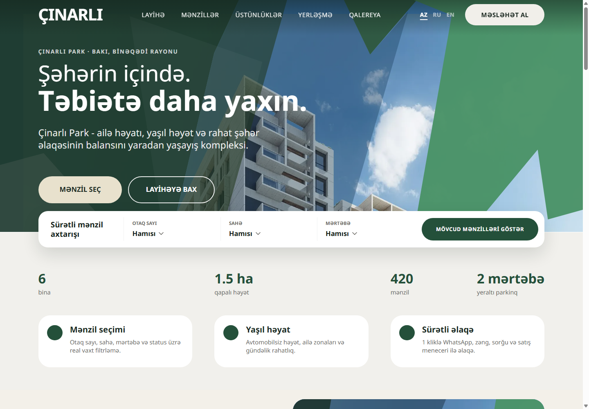

### 02 — Edited calculator

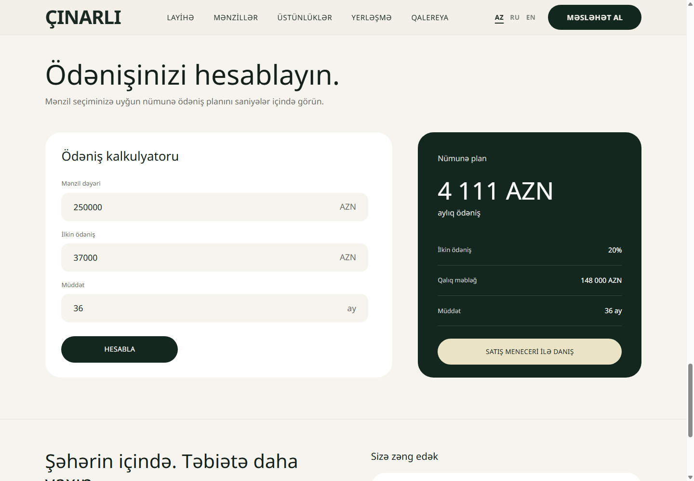

### 03 — Filtered catalogue

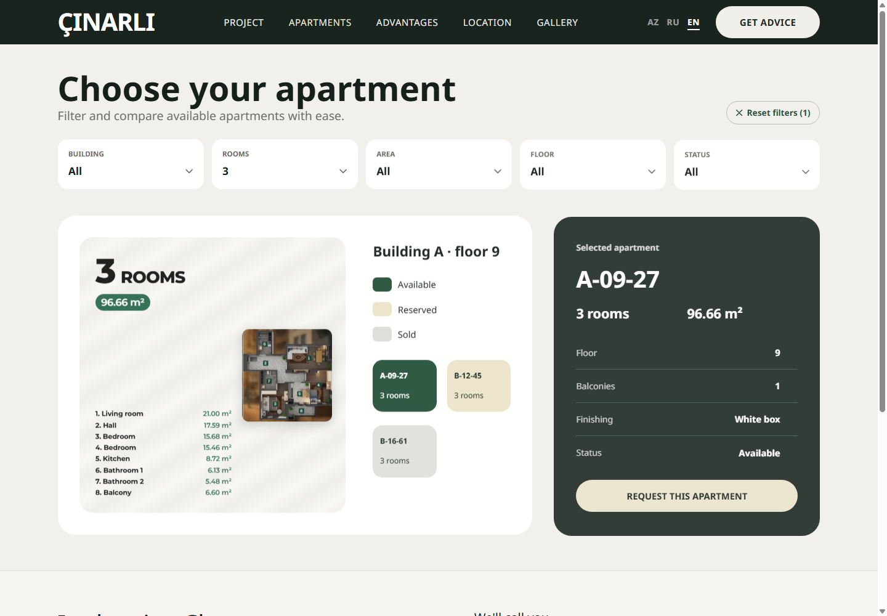

### 04 — Gallery modal

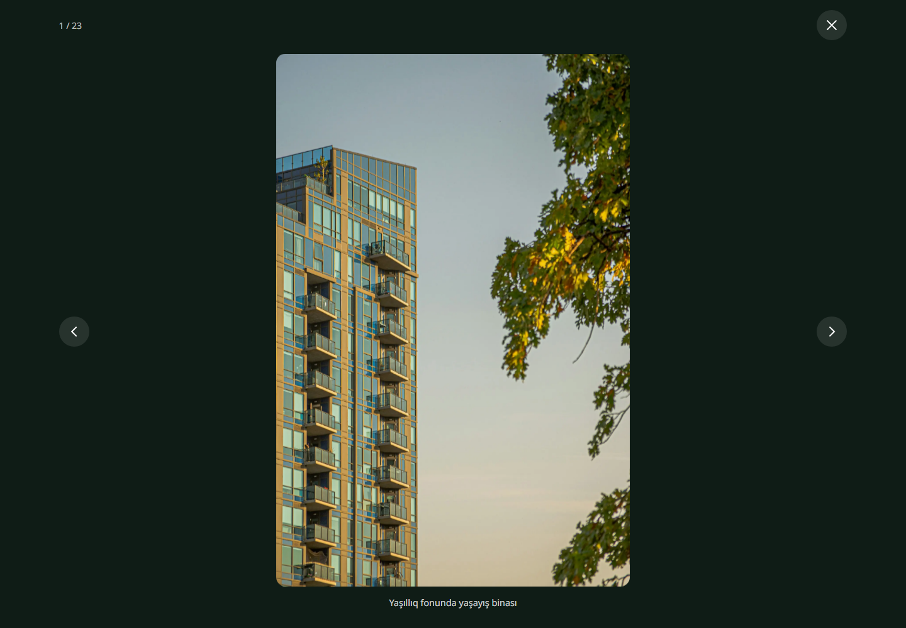

### 05 — Mobile home

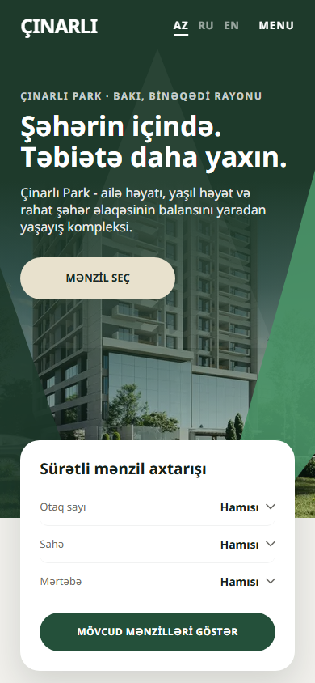

### 06 — Mobile menu

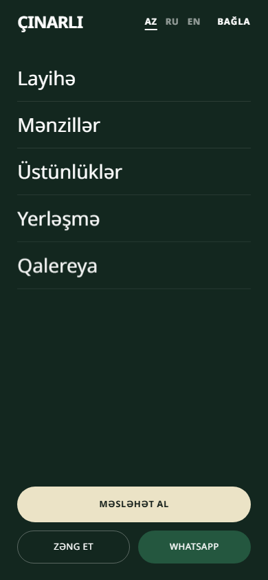

### 07 — Production login

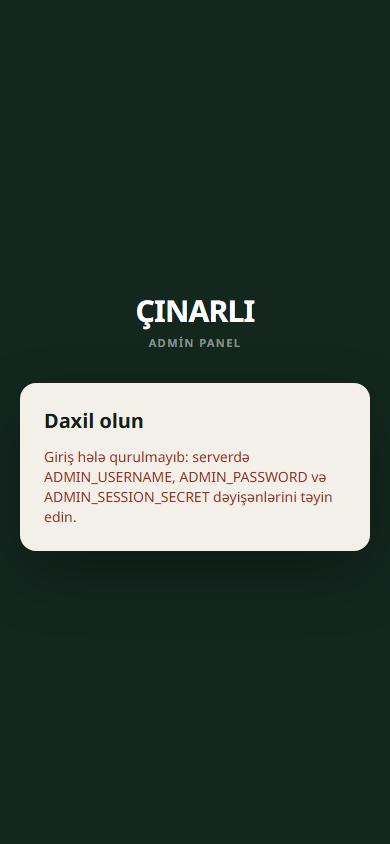

### 08 — Local admin leads

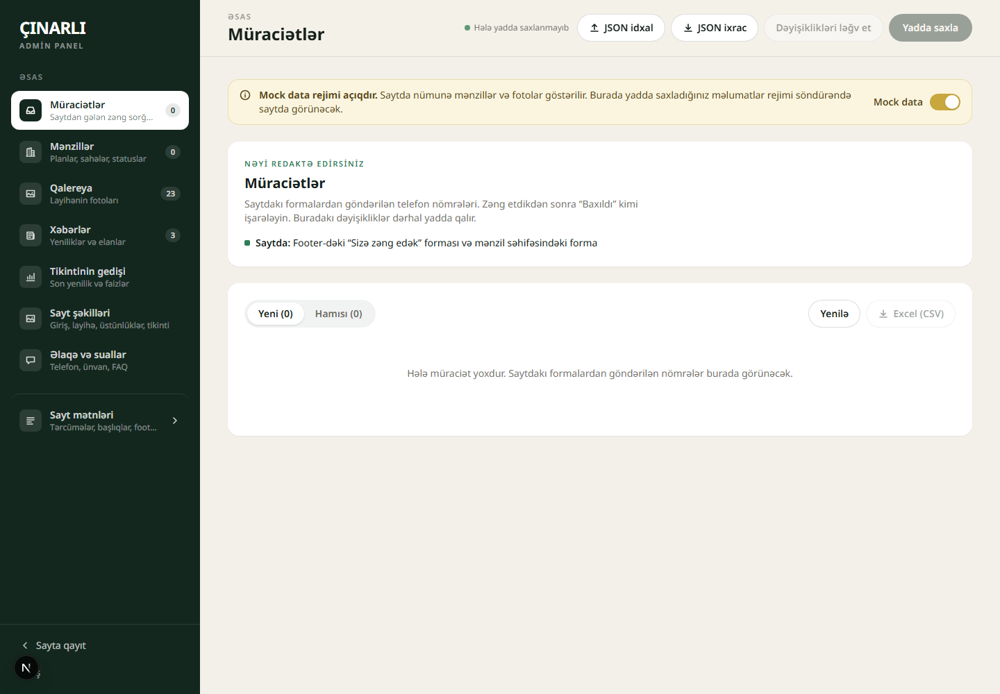

### 09 — FAQ editor

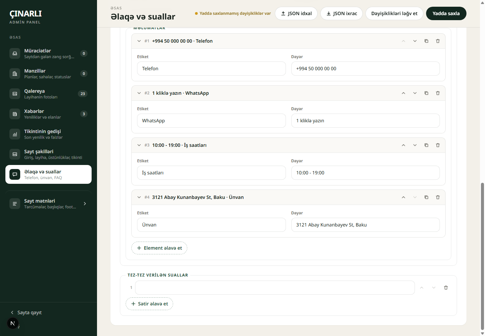

### 10 — Callback confirmation

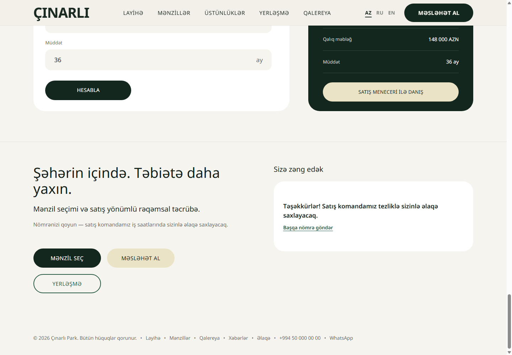

### 11 — Invisible filter focus

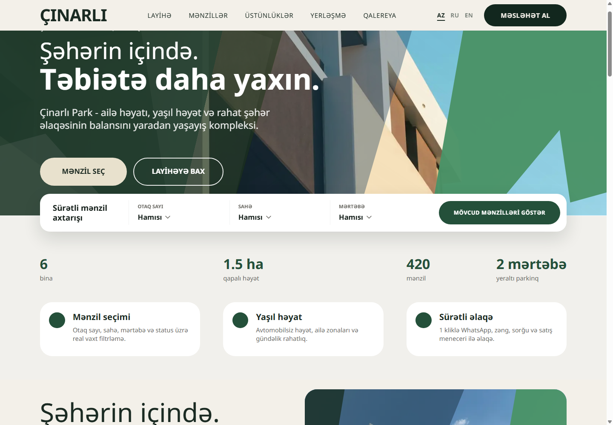

## Repair order and remaining checks

Use the revised [remediation plan](FIX_PLAN.md) for implementation scope, sequencing, and acceptance checks.

1. Confirm the host's Node process count; immediately hide unverified call/WhatsApp actions and address TLS/HTTPS with the host.
2. Ship the eight isolated quick wins with Node's built-in test runner and GitHub Actions: dynamic login, canonical origin, CSV escaping, phone truncation, reduced motion, structured-data total, stable news IDs, and empty FAQ templates.
3. Connect sales actions to the existing callback forms and make the calculator interactive.
4. Protect content/lead writes, validate saved content, repair partial imports, and bound lead intake. Use process-local coordination if the host confirms one serving process.
5. Repair media, language switching, and keyboard interactions; complete the cPanel deployment repair alongside these PRs.

Before production sign-off, verify each numbered finding's targeted checks, the actual process/proxy configuration, persistent data and backup/restore, and the repaired deployment. Keep missing host/business evidence explicit. Preserve public sample-content fallback unless the business chooses a different policy; corrupt stored data must still be protected from destructive writes.

Broader screen-reader/physical-device testing, performance/load measurement, Maps/upload hardening, and the other optional work listed in the plan are follow-ups rather than additional acceptance criteria for the 25 findings. Checks not performed are not claimed as passed.
